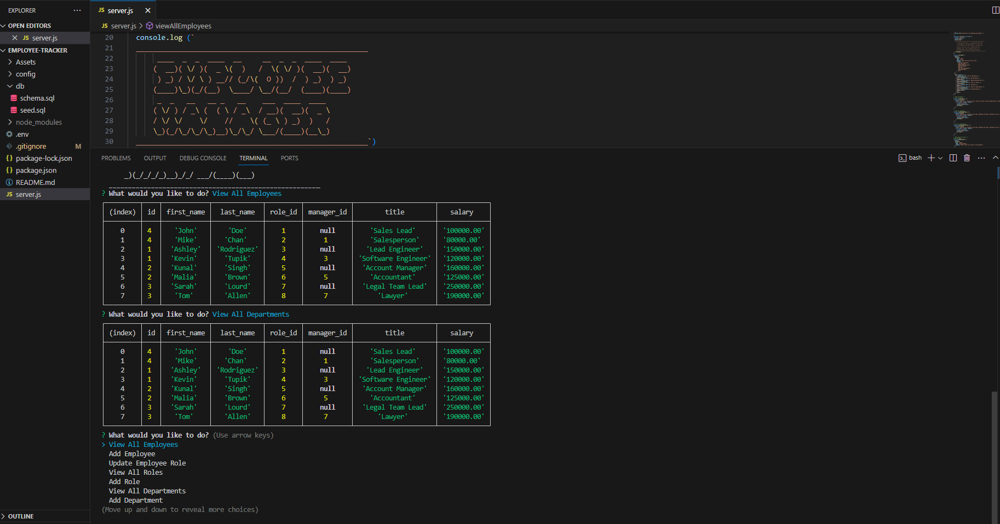

# Employee-Tracker

  ## Description
  The aim of this project was to build a command-line application using Node.js, Inquirer, and MySQL. The application was to be a content management system (CMS) that managed a company's employee database.

  ## Table of Contents
  * [Description](#description)
  * [Installation](#installation)
  * [Usage](#usage)
  * [Licenses](#licenses)
  * [Contributing](#how-to-contribute)
  * [Tests](#tests)
  * [Questions/Contact Info](#questionscontacts)
  * [Credits](#credits)

  ## Installation
  1. Clone the code from this repository
  2. Open the project in VS Code (or similar) and install npm dependancies 
  3. Run db files through mysql before running main code in your terminal
  4. Follow the prompts

  ## Usage
  Screenshots, GIF and Walkthrough link are below...
  
  
   [Link to Video demonstration on Google Drive] (https://drive.google.com/file/d/1tbkwaEC-oWnR0q2Hg8LZFflc7x431MkD/view)

  ## Licenses
  This project is covered under the MIT license.
  To learn more about what this means, click the license button at the top.

  ## How to contribute
   Contact me via the details below

  ## Tests
  N/A

  ## Questions/Contacts
  Have questions about this project?  
  GitHub: https://github.com/Petarlo  

  ## Credits
  N/A
